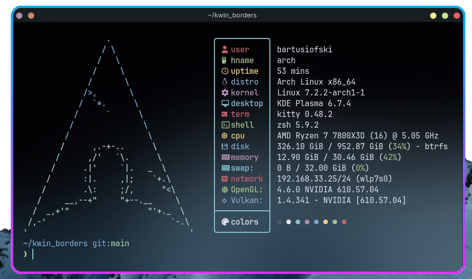

# Lightweight window borders KWin effect
[](LICENSE)   [](https://invent.kde.org/plasma/kwin) [](https://api.kde.org/ecm/) [](#installation)

Borderglow is a lightweight, highly configurable KWin effect that renders smooth GPU-accelerated glowing borders around your windows on KDE Plasma 6 with Wayland. Built and focused on performance so it stays fast and responsive even with multiple windows open at once. Installation guide at [Installation](#installation) section.

<p align="center">
  
  <br>
  <em>Borderglow on terminal emulator on KDE Plasma 6</em>
</p>

## How It Works
> [!IMPORTANT]
> This project relies on modern KWin API which change frequently and sometimes drastically between releases. Make sure you're running a compatible version before building. More info in [Compatibility](#compatibility) section.

Borderglow renders additional borders around windows directly on the GPU using an SDF-based GLSL shader for maximum performance. It hooks into KWin effects API by overriding prePaintWindow and paintWindow. Supports advanced animations.

## Features

- **Customizable color:** Set any 2-color gradient for the glow effect
- **Adjustable thickness:** Control the width of the border
- **Configurable radius:** Match the border's roundness
- **Live KCM configuration:** Adjust settings in real time through a native System Settings panel
- **Per-window rules:** Include or exclude specific applications using GlowRules, matched by window types
- **Animations sync:** Smooth transition synced with KDE animations
- **Low performance overhead:** Optimized shader pipeline designed to stay lightweight even with several glowing windows open
- **Cross-distro support:** Tested and working on modern distros (more info in [Compatibility](#compatibility) section)

## Compatibility

This project requires modern versions of the KWin effects API packages and build tools to build and work correctly:

**Build tools:**
| Package | Required version |
|---|---|
| **g++** | ≥13 |
| **CMake** | ≥3.16 |
| **ECM** | ≥6.5.0 |
| **qt6-tools** | ≥6.5.0 |
| **git** | latest recommended |
| **vulkan-headers** | latest recommended |

**Runtime dependencies:**
| Package | Required version |
|---|---|
| **Qt** | ≥6.5.0 |
| **KWin** | ≥6.7.4 |
| **KDE Frameworks (KF)** | ≥6.5.0 |
| **vulkan-icd-loader** | latest recommended |
| **libepoxy** | latest recommended |

> [!NOTE]
> Because the required package versions are strict, this project may fail to build or run correctly on distros that prioritize stability over up-to-date packages. Make sure all required packages are up to date before building. Most of these packages should already be available in your distros repositories. Borderglow has been tested on a few distros, but the exact minimum version for each package hasn't always been possible to pin down precisely - treat the versions above as a reliable baseline and not an absolute guarantee.

| Distro | Compatibility |
|---|---|
| **Arch Linux** | Stable |
| **CachyOS/EndeavourOS/Manjaro/Garuda Linux** | Stable |
| **Fedora 44 KDE** | Stable |
| **KDE Neon (Ubuntu 24.04 LTS base)** | Stable (requires **kwin-dev** and **libkf6kcmutils-dev** for compilation |
| **Debian 13** | Unstable - does not compile with base packages |
| **Kubuntu 26.04** | Unstable - does not compile with base packages |

If you notice any changes in compatibility with the distros listed here, please [open an issue](../../issues) and let me know.

## Installation

### Arch-based distros
> [!IMPORTANT]
> **Not yet on the AUR.** Due to the ongoing wave of malicious package attacks on the AUR, new account registration has been suspended by the Arch Linux team, so this package cannot be published there yet. Once the AUR is safe and registrations reopen, this package will be submitted and made available via `yay -S` / `paru -S`.
>
> In the meantime, you can build it directly from this repo using the `PKGBUILD` below.

#### Using PKGBUILD
```bash
git clone https://github.com/bartekldw/borderglow
cd borderglow
makepkg -si
```

### Other distros
Make sure you have all build tools installed listed in [Compatibility](#compatibility) section. The best way to build the project yourself is by cloning the repo and running the ready build.sh script:
```bash
git clone https://github.com/bartekldw/borderglow
cd borderglow
./build.sh
```

If you want to build the project without the building script, follow those instructions:
```bash
git clone https://github.com/bartekldw/borderglow
cd borderglow
cmake -B build -S . -DCMAKE_INSTALL_PREFIX=/usr -DCMAKE_BUILD_TYPE=Release
cmake --build build -j$(nproc)
sudo cmake --install build
```
Make sure to restart KWin shell after building if you want to apply the changes immediately:
```bash
kwin_wayland --replace & disown
```

## Roadmap
This project is actively maintained and will continue to receive updates with more advanced features. Here's what you can expect in future releases:
| Release | New feature | Description |
|---|---|---|
| **≥1.0** | Bug fixes | Bug fixes known in the known issues section below (except for X11 support) |
| **1.1** | Window blacklist | Lets you choose which windows the effect should be applied on |
| **1.1** | Improved KCM UI | More friendly settings UI to manage more advanced options faster |
| **1.1** | Solid color option | Instead of forced gradient SDF shader, now lets you choose between a 2-color gradient and a solid color |
| **1.2** | Improved color options | Lets you choose a gradient of a custom number of colors |
| **1.2** | Improve SDF shader to include gradient rotation | Lets you set the gradient effect at any degree |
| **1.2** | Per-window profiling | Set custom borderglow rules for other windows of your own |
| **≥1.3** | Subtle animations | Set custom subtle animations for your borderglow gradients |
| **≥1.3** | Custom window state profiling | Set custom profiles for focus\hover\active\inactive window states |
| **≥1.3** | Shadow effect | Set custom, subtle shadows for your windows |
| **≥1.3** | Double border | Lets you add another border to a window |
| **≥1.3** | Maximized detection fix | Dependent on future KWin API exposing reliable maximized state; no ETA |

## Known Issues

### Window maximized state detection
**Maximized detection is heuristic-based.** The effect infers maximized state from the window's `frameGeometry()`, so detection isn't always perfectly accurate. As a side effect, a normal (non-maximized) window that happens to match the maximized size will also be drawn with zero radius. Additionally some CSD (client-side decoration) clients (Electron-based etc.) can report a stuck maximized `frameGeometry()` while actually being rendered smaller or offset via the paint transform. This could be turned off in effect config, but edge cases may remain. A proper fix depends on KWin exposing a reliable maximized-state API which doesn't currently exist based on the headers. **Until then, this remains heuristic-based.**

### X11
**Not supported and won't be.** The plugin targets KWin newer APIs (KWin ≥ 6.7.4), which are developed against `kwin_wayland` first. Since the kwin_x11 and kwin_wayland codebases were split, KWin/X11 no longer receives new features, only build fixes and backported window-management fixes. C++ effects like this one aren't ABI-compatible across the two backends, so they have to specifically target one or the other. Given KDE ongoing move toward a Wayland only future for Plasma, **this effect is developed and tested exclusively on Wayland.**

> [!CAUTION]
> **If you're on X11, this effect simply won't load and work.**

If you find any other issues, please [open an issue](../../issues) and let me know.

## Contributing
This is primarily a personal, learning project, so I'm not actively accepting pull requests - but feel free to fork it or open an issue if you find a bug in [issues](../../issues) tab.

## License
This project is licensed under the GPL-3.0 license, found in the [LICENSE](LICENSE) file.